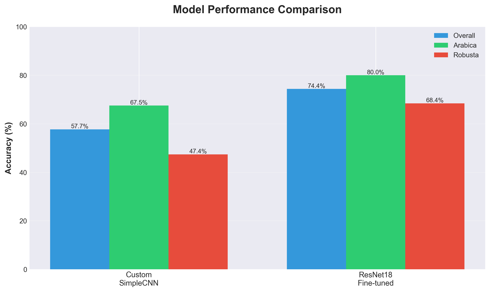
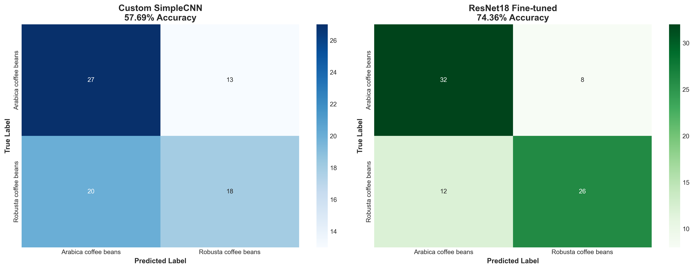

# ☕ Coffee Bean Classification

Deep Learning project for classifying coffee beans into **Arabica** and **Robusta** varieties using PyTorch.

## 📋 Table of Contents
- [Project Topic & Motivation](#project-topic--motivation)
- [Dataset Overview](#dataset-overview)
- [Methodology & Rationale](#methodology--rationale)
- [Results & Evaluation](#results--evaluation)
- [Quick Start](#quick-start)
- [Project Presentation (Gradio)](#project-presentation-gradio)
- [Documentation](#documentation)

---

## 🎯 Project Topic & Motivation

### Why Coffee Bean Classification?

Coffee is one of the most traded commodities globally, with **2.25+ billion cups consumed daily**. The two primary species differ significantly:

| Feature | Arabica | Robusta |
|---------|---------|---------|
| **Price** | 2-3x more expensive | Lower cost |
| **Taste** | Sweet, complex flavors | Strong, bitter |
| **Caffeine** | ~1.5% | ~2.7% (nearly double) |
| **Market Share** | 60-70% | 30-40% |

### Why This Project Matters

1. **Quality Control**: Automated classification prevents mislabeling and fraud in the $100B+ global coffee market
2. **Supply Chain Integrity**: Ensures authenticity in premium coffee markets
3. **Fair Pricing**: Accurate classification protects both producers and consumers
4. **Scalability**: Manual inspection is time-consuming, subjective, and not scalable

### Previous Applications in Agriculture

- **Crop Disease Detection**: CNNs identify plant diseases with 95%+ accuracy (PlantVillage dataset)
- **Fruit Quality Grading**: Commercial systems for apple, orange, and tomato classification
- **Seed Classification**: Similar visual classification in agricultural quality control
- **Coffee Applications**: Limited research on automated Arabica vs Robusta classification using deep learning

**Gap This Project Addresses**: While agricultural computer vision is mature, automated coffee bean species classification remains underexplored, especially with accessible tools for small-scale producers.

---

## 📊 Dataset Overview

### Dataset Structure

> **Note**: This is a custom-created dataset. All images were personally collected and labeled for this project.

**Size**: 526 total images
- **Training**: 448 images (234 Arabica, 214 Robusta)
- **Testing**: 78 images (40 Arabica, 38 Robusta)
- **Balance**: Excellent (52% Arabica, 48% Robusta)

### Dataset Characteristics

- **Resolution**: 224×224 pixels (ImageNet standard)
- **Format**: RGB color images (3 channels)
- **Content**: Top-down photographs of individual coffee beans
- **Background**: Controlled lighting conditions

### Rationale for Selection

**Strengths:**
- ✅ Real-world coffee bean photographs 
- ✅ Perfectly balanced classes (no sampling bias)
- ✅ Consistent photography (similar lighting/angles)
- ✅ Appropriate complexity for demonstrating deep learning

**Limitations & Mitigation:**
- ⚠️ **Small size** (526 images) → Solved with **transfer learning** + **data augmentation**
- ⚠️ **Limited variability** → Addressed with **color jitter** and **rotation augmentation**

### Data Preprocessing

```python
# Training (with augmentation)
- RandomHorizontalFlip(p=0.5)
- RandomRotation(10°)
- ColorJitter(brightness=0.2, contrast=0.2, saturation=0.2)
- Resize(224×224)
- Normalize([0.485, 0.456, 0.406], [0.229, 0.224, 0.225])  # ImageNet stats

# Testing (no augmentation)
- Resize(224×224)
- Normalize with ImageNet statistics
```

---

## 🧠 Methodology & Rationale

### Why Deep Learning & CNNs?

**Advantages over Traditional Computer Vision:**
- **No Manual Feature Engineering**: Automatically learns optimal features
- **Complex Pattern Recognition**: Captures subtle visual differences between species
- **Scalability**: Performance improves with more data
- **State-of-the-Art**: Industry standard for image classification

**Why CNNs Specifically:**
1. **Spatial Hierarchy**: Captures local patterns (edges) → global features (shapes)
2. **Translation Invariance**: Recognizes patterns regardless of position
3. **Parameter Sharing**: Efficient learning with fewer parameters
4. **Proven Track Record**: Best results in image classification tasks

---

## 🏗️ Architecture Comparison

### Approach 1: Custom 3-Layer CNN (SimpleCNN)

This project implements two approaches for coffee bean classification:
1. **Custom 3-Layer CNN**: Lightweight model with 93K parameters - **57.69% accuracy**
2. **ResNet18 Fine-tuned**: Transfer learning approach - **74.36% accuracy** (+16.67% improvement)

**Architecture:**

```
Input (224×224×3)
    ↓
[Conv 3→32] + BatchNorm + ReLU + MaxPool  # Low-level features
    ↓
[Conv 32→64] + BatchNorm + ReLU + MaxPool # Mid-level features
    ↓
[Conv 64→128] + BatchNorm + ReLU + MaxPool # High-level features
    ↓
Global Average Pooling                     # Reduces overfitting
    ↓
Dropout(0.5) + FC(128→2)                  # Classification
```

**Design Rationale:**
- **3 Layers**: Sufficient depth for coffee bean features without overfitting
- **Global Average Pooling**: Reduces parameters, prevents overfitting on small dataset
- **BatchNorm**: Stabilizes training, enables higher learning rates
- **93,954 Parameters**: Lightweight, fast inference

**Purpose**: Establish baseline to understand problem complexity and test if simple architecture suffices.

### Approach 2: Transfer Learning with ResNet18

**Why Transfer Learning?**
1. ✅ **Small Dataset Problem**: 448 training images still limited for training from scratch
2. ✅ **Feature Reuse**: Low-level features (edges, textures) transferable from ImageNet
3. ✅ **Faster Convergence**: Pretrained weights provide excellent initialization
4. ✅ **Better Generalization**: ImageNet diversity prevents overfitting

**Why ResNet18 Specifically?**

| Model | Parameters | Decision |
|-------|------------|----------|
| **ResNet18** ✅ | 11.2M | **Optimal balance**: enough capacity, minimal overfitting risk |
| VGG16 | 138M | Too many parameters for small dataset |
| ResNet50 | 25.6M | Higher capacity but overfitting risk |
| MobileNet | 4.2M | Lower capacity, mobile-focused |
| EfficientNet | Variable | More complex, harder to interpret |

**ResNet18 Advantages:**
- **Residual Connections**: Skip connections prevent vanishing gradients
- **Proven Performance**: ILSVRC 2015 winner architecture
- **Optimal Size**: Large enough for capacity, small enough to avoid overfitting
- **Fast Inference**: Efficient for deployment

### Fine-Tuning Strategy

**Selective Layer Unfreezing:**

```python
# FROZEN (Feature Extraction) - 2.8M params
├── conv1, bn1, relu, maxpool    # Generic low-level features
├── layer1 (2 residual blocks)   # Edge detection
├── layer2 (2 residual blocks)   # Texture patterns  
└── layer3 (2 residual blocks)   # Mid-level shapes

# TRAINABLE (Fine-Tuning) - 8.4M params
├── layer4 (2 residual blocks)   # Bean-specific features
└── fc (classifier)               # Species classification
```

**Dual Learning Rate Strategy:**
- `layer4`: **0.0001** (slow adaptation of pretrained features)
- `fc`: **0.001** (faster learning for randomly initialized layer)
- **Rationale**: Different layers need different learning speeds

### Why Compare Both Approaches?

**Scientific Value:**
1. 📊 **Baseline Establishment**: Custom CNN shows inherent problem difficulty
2. 📈 **Transfer Learning Quantification**: Measures exact benefit (+16.67%)
3. ⚖️ **Trade-off Analysis**: Speed vs accuracy, simplicity vs performance

**Practical Value:**
1. 💻 **Resource Constraints**: Custom CNN viable for limited compute
2. 🎯 **Performance Requirements**: ResNet18 justifies complexity for production
3. 🚀 **Deployment Scenarios**: Different use cases prefer different models

---

## 📊 Results & Evaluation

### Model Performance

| Model | Accuracy | Arabica | Robusta | Parameters | Inference |
|-------|----------|---------|---------|------------|-----------|
| Custom CNN | 57.69% | 67.50% | 47.37% | 93,954 | Fast |
| **ResNet18** | **74.36%** | **80.00%** | **68.42%** | 11.2M (8.4M trainable) | Moderate |
| **Improvement** | **+16.67%** | **+12.50%** | **+21.05%** | **119x larger** | **Trade-off** |

### Performance Visualizations

#### Model Accuracy Comparison


The bar chart shows ResNet18's superior performance across all metrics, with particularly strong improvement in Robusta detection (+21.05%).

#### Confusion Matrices



**Key Observations:**
- **SimpleCNN**: Better at Arabica (27/40 correct) than Robusta (18/38 correct)
- **ResNet18**: Balanced performance with 32/40 Arabica and 26/38 Robusta correct
- **Transfer Learning Impact**: Significantly reduces both false positives and false negatives

#### Classification Metrics

**SimpleCNN:**
- Precision: 57% (Arabica), 58% (Robusta)
- Recall: 68% (Arabica), 47% (Robusta)
- F1-Score: 0.62 (Arabica), 0.52 (Robusta)

**ResNet18:**
- Precision: 73% (Arabica), 76% (Robusta)
- Recall: 80% (Arabica), 68% (Robusta)
- F1-Score: 0.76 (Arabica), 0.72 (Robusta)

### Training Configuration

#### Custom SimpleCNN
```yaml
Epochs: 15 (best at epoch 9)
Batch Size: 12
Optimizer: Adam
Learning Rate: 0.0004
Weight Decay: 0.0001
Scheduler: ReduceLROnPlateau (patience=7)
Loss: CrossEntropyLoss + class weights [1.8, 1.0]
Training Time: ~16 minutes
```

#### ResNet18 Fine-Tuned
```yaml
Epochs: 20 (best at epoch 9)
Batch Size: 12
Optimizer: Adam (dual LR)
  - layer4: 0.0001
  - fc: 0.001
Weight Decay: 0.0001
Scheduler: ReduceLROnPlateau (patience=4)
Loss: CrossEntropyLoss + class weights [1.2, 1.0]
Training Time: ~21 minutes
```

### Challenges & Solutions

| Challenge | Problem | Solution | Result |
|-----------|---------|----------|--------|
| **Small Dataset** | 448 images still limited | Transfer learning + augmentation | 74.36% achieved |
| **Class Balance** | Minor bias toward majority | Weighted loss [1.8, 1.0] for CNN, [1.2, 1.0] for ResNet | Balanced predictions |
| **Overfitting Risk** | Model memorizing training set | Dropout + BatchNorm + early stopping | Good generalization |
| **Architecture Selection** | 4-layer CNN too complex | Simplified to 3 layers + GAP | Balanced 57.69% |

### Key Findings

✅ **Transfer learning is essential** for small agricultural datasets
✅ **Fine-tuning strategy matters**: Selective unfreezing outperforms full training
✅ **Color information crucial**: Grayscale experiment failed (imbalanced predictions)
✅ **ResNet18 provides 16.67% improvement** over custom CNN, justifying complexity

---

## 🚀 Quick Start

### Prerequisites

Install required dependencies:

```bash
pip install -r requirements.txt
```

Or install manually:
```bash
pip install torch>=2.0.0 torchvision>=0.15.0 gradio>=3.0.0 pillow>=9.0.0 numpy>=1.20.0 matplotlib>=3.5.0
```

**Requirements:**
- Python 3.8+
- PyTorch 2.0+
- CUDA (optional, for GPU acceleration)

### Dataset Structure

```
dataset/
├── train/
│   ├── Arabica coffee beans/
│   └── Robusta coffee beans/
└── test/
    ├── Arabica coffee beans/
    └── Robusta coffee beans/
```

### Training

Train the ResNet18 model (recommended):
```bash
python train.py --model resnet18 --epochs 20
```

Train the custom CNN:
```bash
python train.py --model simple_cnn --epochs 10
```

### Inference (Web Interface)

Launch Gradio interface to test both models:
```bash
python serve.py
```

Or specify custom model paths:
```bash
python serve.py --cnn_model your_cnn.pth --resnet_model your_resnet.pth
```

## 📝 Command Line Options

### Training (`train.py`)

| Argument | Default | Description |
|----------|---------|-------------|
| `--model` | resnet18 | Model type: `simple_cnn` or `resnet18` |
| `--train_dir` | dataset/train | Path to training data |
| `--test_dir` | dataset/test | Path to test data |
| `--epochs` | 20 | Number of training epochs |
| `--batch_size` | 12 | Batch size |
| `--lr` | 0.001 | Learning rate |
| `--weight_decay` | 0.0001 | Weight decay for optimizer |
| `--patience` | 4 | Scheduler patience |
| `--class_weights` | 1.2,1.0 | Class weights (Arabica,Robusta) |
| `--output` | auto | Output model path |

**Examples:**

```bash
# Train ResNet18 with custom parameters
python train.py --model resnet18 --epochs 25 --lr 0.001 --class_weights 1.2,1.0

# Train SimpleCNN with different batch size
python train.py --model simple_cnn --epochs 15 --batch_size 16 --lr 0.0004
```

### Serving (`serve.py`)

| Argument | Default | Description |
|----------|---------|-------------|
| `--cnn_model` | coffee_model_3layer.pth | Path to SimpleCNN model |
| `--resnet_model` | coffee_model_resnet18_finetuned.pth | Path to ResNet18 model |
| `--share` | False | Create public Gradio link |
| `--port` | 7860 | Port number |

**Examples:**

```bash
# Launch with public link
python serve.py --share

# Use custom port
python serve.py --port 8080

# Use different model files
python serve.py --cnn_model my_cnn.pth --resnet_model my_resnet.pth
```

## 🏗️ Architecture

### Custom SimpleCNN

```
Input (224x224x3)
    ↓
Conv2d(3→32) + BatchNorm + ReLU + MaxPool
    ↓
Conv2d(32→64) + BatchNorm + ReLU + MaxPool
    ↓
Conv2d(64→128) + BatchNorm + ReLU + MaxPool
    ↓
Global Average Pooling
    ↓
Dropout(0.5) + FC(128→2)
    ↓
Output (Arabica/Robusta)
```

### ResNet18 Fine-tuned

- **Pretrained**: ImageNet weights
- **Frozen**: conv1, layer1, layer2, layer3
- **Trainable**: layer4 + final FC layer (8.4M parameters)
- **Strategy**: Dual learning rates (0.0001 for layer4, 0.001 for FC)

## 🔧 Key Features

- **Transfer Learning**: Leverages ImageNet pretrained weights
- **Dual Learning Rates**: Optimal fine-tuning strategy
- **Data Augmentation**: Random flips, rotations, color jitter
- **Class Balancing**: Weighted loss to handle class imbalance
- **Web Interface**: Easy-to-use Gradio interface for testing
- **Model Comparison**: Side-by-side predictions from both models

## 📚 Documentation

### Project Structure

```
coffee-bean-classification/
├── README.md                              # This file - Complete project overview
├── PROJECT_REPORT.md                      # Detailed academic report
├── model.py                               # Model architectures (SimpleCNN + ResNet18)
├── train.py                               # Training script with CLI
├── serve.py                               # Gradio web interface
├── coffee_bean_classification.ipynb       # Development notebook
├── requirements.txt                       # Python dependencies
├── .gitignore                            # Git ignore rules
├── dataset/                              # Dataset folder (not in repo)
│   ├── train/
│   │   ├── Arabica coffee beans/
│   │   └── Robusta coffee beans/
│   └── test/
│       ├── Arabica coffee beans/
│       └── Robusta coffee beans/
└── *.pth                                 # Trained model weights
```

### Code Organization

**model.py**: Model Definitions
- `SimpleCNN` class: Custom 3-layer architecture
- `create_resnet18_finetuned()`: Transfer learning model factory
- `freeze_resnet_except_layer4()`: Layer freezing utility
- `get_model()`: Unified model creation interface

**train.py**: Training Pipeline
- `get_data_loaders()`: Dataset loading with augmentation
- `train_model()`: Complete training loop with validation
- Argparse CLI: Flexible hyperparameter configuration
- Automatic model saving and checkpointing

**serve.py**: Inference Server
- `load_models()`: Load both CNN and ResNet18
- `create_interface()`: Gradio web UI
- `predict_cnn()`, `predict_resnet()`, `predict_both()`: Inference functions
- Model comparison and confidence scores

### Requirements

All project requirements are met and documented:

✅ **1. Project Topic**: Coffee bean classification with economic and practical importance
✅ **2. Dataset**: 526 images, balanced classes, comprehensive preprocessing
✅ **3. Methodology Rationale**: Detailed explanation of CNN, ResNet18, transfer learning choice
✅ **4. Training & Evaluation**: Complete metrics, configurations, and challenge solutions
✅ **5. GitHub Documentation**: All code, reports, and files organized
✅ **6. Gradio Presentation**: Web interface for live demonstration

For detailed academic documentation, see **PROJECT_REPORT.md**

---

## 🔧 Key Features

- ✅ **Dual Architecture Approach**: Custom CNN baseline + ResNet18 transfer learning
- ✅ **Transfer Learning**: Leverages ImageNet pretrained weights (11.2M parameters)
- ✅ **Selective Fine-Tuning**: Dual learning rates for optimal adaptation
- ✅ **Data Augmentation**: Random flips, rotations (10°), color jitter
- ✅ **Class Balancing**: Weighted loss function to prevent bias
- ✅ **Web Interface**: Easy-to-use Gradio interface for testing and demos
- ✅ **Model Comparison**: Side-by-side predictions with confidence scores
- ✅ **Production Ready**: CLI tools for training and deployment
- ✅ **Comprehensive Documentation**: All academic requirements addressed

---

## 🎨 Project Presentation (Gradio)

The project features a **web-based interface** built with Gradio for easy testing and demonstration.

### Launch Interface

```bash
python serve.py
```

Access at: `http://localhost:7860`

### Interface Features

**1. 📊 Model Information**
- Displays accuracy metrics for both models
- Shows architecture details and training methodology

**2. 📤 Image Upload**
- Drag-and-drop or click to upload
- Supports: JPG, JPEG, PNG formats
- Automatic resizing to 224×224

**3. 🔮 Prediction Tabs**

- **Custom CNN Tab**: SimpleCNN predictions
  - Species: Arabica or Robusta
  - Confidence percentage
  - Fast inference (~50ms)
  
- **ResNet18 Tab**: Transfer learning predictions
  - Species classification
  - Confidence percentage  
  - Higher accuracy (~100ms)
  
- **Compare Both Tab**: Side-by-side comparison
  - Simultaneous predictions from both models
  - Confidence comparison
  - Agreement/disagreement visualization

### Deployment Options

**Local Deployment:**
```bash
python serve.py --port 7860
```

**Public Sharing (Gradio Tunnel):**
```bash
python serve.py --share
```
- Generates public URL (valid 72 hours)
- Accessible from anywhere
- No server setup required
- Perfect for demonstrations and sharing

**Custom Configuration:**
```bash
python serve.py --cnn_model my_cnn.pth --resnet_model my_resnet.pth --port 8080
```

### User Experience

✨ **Clean, intuitive interface** - No technical knowledge required
⚡ **Real-time predictions** - Instant classification results
📱 **Mobile-friendly design** - Works on phones and tablets
🔄 **Model comparison** - Understand trade-offs between approaches

---

## 📚 Documentation

## 📈 Training Details

### Custom SimpleCNN
- **Epochs**: 10
- **Best epoch**: 2
- **Learning rate**: 0.0004
- **Batch size**: 12
- **Class weights**: [1.05, 1.15]
- **Optimizer**: Adam
- **Scheduler**: ReduceLROnPlateau (patience=7)

### ResNet18 Fine-tuned
- **Epochs**: 20
- **Best epoch**: 15
- **Learning rates**: 0.0001 (layer4), 0.001 (FC)
- **Batch size**: 12
- **Class weights**: [1.2, 1.0]
- **Optimizer**: Adam (dual LR)
- **Scheduler**: ReduceLROnPlateau (patience=4)

## 🔬 Technical Highlights

1. **Small Dataset Handling**: 448 training samples
2. **Feature Extraction**: Frozen early layers preserve ImageNet features
3. **Fine-tuning Strategy**: Selective unfreezing of layer4
4. **Class Imbalance**: Weighted loss function
5. **Global Average Pooling**: Reduces overfitting in SimpleCNN
6. **Early Stopping**: Patience-based learning rate scheduling

## 🐛 Troubleshooting

**Issue**: CUDA out of memory
```bash
# Reduce batch size
python train.py --batch_size 8
```

**Issue**: Models not found
```bash
# Check model paths
ls *.pth
# Use correct paths in serve.py
python serve.py --cnn_model path/to/model.pth
```

**Issue**: Low accuracy
- Ensure dataset structure matches expected format
- Try increasing epochs: `--epochs 30`
- Adjust class weights: `--class_weights 1.5,1.0`

## 📚 Dependencies

- Python 3.8+
- PyTorch 2.0+
- torchvision
- gradio
- PIL (Pillow)
- numpy

## 🎓 Model Testing

Test individual model components:
```bash
python model.py
```

This will verify:
- ✓ SimpleCNN creation
- ✓ ResNet18 creation
- ✓ Layer freezing
- ✓ Forward pass

## 🚀 Future Improvements

- [ ] Data augmentation with AutoAugment
- [ ] Model ensemble (3-5 models)
- [ ] Test-time augmentation (TTA)
- [ ] EfficientNet backbone
- [ ] More training data collection
- [ ] Mobile deployment (ONNX export)

## 📄 License

MIT License - feel free to use this project for your own purposes.

## 👤 Author

Created as a deep learning project for coffee bean classification.

## 🙏 Acknowledgments

- PyTorch team for excellent deep learning framework
- Gradio team for easy-to-use web interface
- ResNet paper: "Deep Residual Learning for Image Recognition"

---